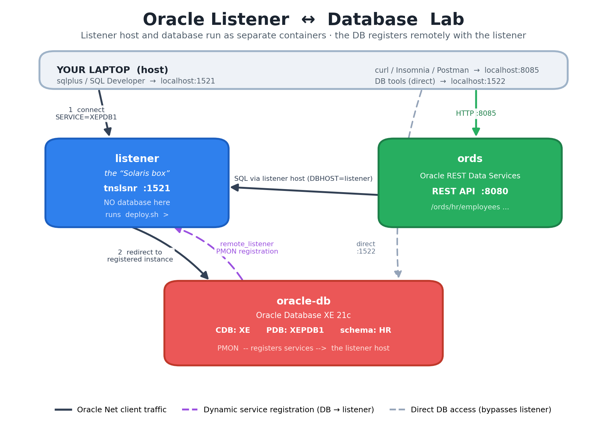

# 🛰️ Oracle Listener ↔ Database Lab 🗄️

A fully‑containerised playground that recreates a classic enterprise topology:
**an Oracle Net *listener* running on one host, wired to an Oracle *database*
running on a completely separate host** — the pattern found in many real
estates, e.g. a Solaris box that runs *only* a listener in front of a remote
database (nicknamed **"the Solaris box"** throughout this lab). Break it, poke
it, watch the listener and the database talk to each other. 🔬

> 💡 **Everything runs in containers.** There is **no script, no binary, and no
> Oracle install on the host machine**. Even the data deploy — traditionally a
> script run on the listener host — runs *inside the listener container*.

---

## 🧭 Table of contents
- [🏛️ Architecture](#️-architecture)
- [📦 What's in the box](#-whats-in-the-box)
- [🗒️ A note on versions (10g vs 21c) and CMAN](#️-a-note-on-versions-10g-vs-21c-and-cman)
- [✅ Prerequisites](#-prerequisites)
- [🚀 Quick start](#-quick-start)
- [🔌 How the listener talks to the database](#-how-the-listener-talks-to-the-database)
- [🌱 Deploying sample data](#-deploying-sample-data-the-realism-bit)
- [🌐 REST APIs (ORDS) + Insomnia/Postman](#-rest-apis-ords--insomniapostman)
- [📊 Live registration dashboard](#-live-registration-dashboard)
- [📚 Intro: Oracle & listeners from zero](docs/INTRO.md)
- [🎓 Student workbook (8 missions)](docs/EXERCISES.md) · [✅ answer key](docs/SOLUTIONS.md)
- [🔗 Connection cheat‑sheet](#-connection-cheat-sheet)
- [📚 Command reference](#-command-reference)
- [🧪 Suggested experiments](#-suggested-experiments)
- [🆘 Troubleshooting](#-troubleshooting)
- [🧹 Teardown](#-teardown)

---

## 🏛️ Architecture



> 🎨 Generated by [`docs/architecture_diagram.py`](docs/architecture_diagram.py) —
> run `python docs/architecture_diagram.py` to regenerate `docs/architecture.png`
> (only needs `matplotlib`). The 📊 `dashboard` container (port `8090`) is
> omitted from the diagram for clarity — it only *observes* the topology.

<details>
<summary>📐 Same diagram as ASCII art</summary>

```
    YOUR LAPTOP (host)
        │  sqlplus / SQL Developer        │  curl / Insomnia / Postman
        │  → localhost:1521               │  → localhost:8085
        ▼                                 ▼
 ┌───────────────────┐            ┌───────────────────┐
 │  🛰️  listener      │            │  🌐  ords          │
 │  "the Solaris box" │            │  REST Data Services│
 │  tnslsnr  :1521    │            │  :8080             │
 │  NO database here  │            └─────────┬─────────┘
 └─────────┬─────────┘                       │
           │  redirect to registered instance│  SQL
           ▼                                  ▼
 ┌─────────────────────────────────────────────────────┐
 │  🗄️  oracle-db   —   Oracle XE 21c                    │
 │  CDB: XE     PDB: XEPDB1     schema: HR               │
 │  PMON ──registers services──▶ the listener host       │
 └─────────────────────────────────────────────────────┘
            (direct DB access for tools: localhost:1522)
```

</details>

The magic line that wires the two hosts together lives in
[`db/startup/01_register_remote_listener.sh`](db/startup/01_register_remote_listener.sh):

```sql
ALTER SYSTEM SET remote_listener='(ADDRESS=(PROTOCOL=TCP)(HOST=listener)(PORT=1521))';
```

This tells the database's **PMON** process to *register its services with a
listener on another machine*. The listener then knows about `XEPDB1` even though
it has no database of its own. 🤝

---

## 📦 What's in the box

| 🧩 Container | Role | Image | Ports |
|------------|------|-------|-------|
| 🗄️ `oracle-db` | The **database** instance (CDB `XE`, PDB `XEPDB1`, schema `HR`) | `gvenzl/oracle-xe:21-slim-faststart` | `1522→1521` (direct) |
| 🛰️ `listener` | The **listener host** — runs only `tnslsnr`, *no DB*. The deploy script runs **here**. | built from [`listener/Dockerfile`](listener/Dockerfile) | `1521→1521` |
| 🌐 `ords` | **Oracle REST Data Services** — exposes `HR` as REST | `container-registry.oracle.com/database/ords:latest` | `8085→8080` |
| 📊 `dashboard` | **Live registration dashboard** (React) — watch services register/deregister in real time | built from [`frontend/Dockerfile`](frontend/Dockerfile) | `8090→80` |

> 🔎 The dashboard's data comes from a tiny **poller** baked into the `listener`
> container ([`listener/poller.sh`](listener/poller.sh)). It runs `lsnrctl status`
> **locally on the listener host** every 3s — because Oracle 21c refuses *remote*
> `lsnrctl` admin over TCP (`TNS-01189`) — and writes JSON to a shared volume that
> nginx serves to the React app. Still 100% in‑container. 🐳

---

## 🗒️ A note on versions (10g vs 21c) and CMAN

- **Why not Oracle 10g?** 🤔 Oracle never published 10g container images — 10g
  predates Docker by years, and the only 10g images floating around are
  unofficial, x86‑only and frequently broken on modern engines. This lab uses
  **Oracle Database 21c Express Edition (XE)**, which is free, official‑binary
  based and container‑native. Everything you learn about listeners,
  registration, `lsnrctl`, TNS and ORDS applies identically to 10g/11g/19c.

- **Why a *remote listener*, not CMAN?** 🧠 The topology this lab models — a
  listener host wired to a database on a separate instance — is *precisely*
  Oracle's **remote‑listener registration** pattern, so that's what it uses.
  (Oracle **Connection Manager / CMAN** is a different animal — a
  proxy/firewall — and its binaries aren't shipped with XE; they live behind
  Oracle's SSO‑gated client download, which would break this lab's
  zero‑manual‑downloads principle.) The remote‑listener model delivers the real
  PMON‑registers‑with‑a‑remote‑listener behaviour for free. 🆓

---

## ✅ Prerequisites

- 🐳 Docker Desktop (Compose v2). Check: `docker compose version`
- 🌐 Internet access to pull the images (`oracle-xe`, `ords`, `node`, `nginx`).
  All of them pull **anonymously** — no Oracle login is normally required.
  - 🔑 *If* the ORDS pull ever returns `unauthorized`, do a one‑time free login
    and accept the licence at <https://container-registry.oracle.com>:
    ```powershell
    docker login container-registry.oracle.com
    ```

---

## 🚀 Quick start

```powershell
# 1️⃣ Build the listener image and start the DB + listener
docker compose up -d --build oracle-db listener

# 2️⃣ Watch the database register itself with the listener host (≈90s first run)
docker compose logs -f oracle-db        # wait for "DATABASE IS READY TO USE!"

# 3️⃣ Prove the listener now serves the remote database
docker compose exec listener lsnrctl status      # look for service "xepdb1"

# 4️⃣ Run the DEPLOY (inside the listener box, through the listener → DB)
docker compose exec listener bash /deploy/deploy.sh

# 5️⃣ (Optional) Start ORDS and turn the HR schema into REST APIs
docker compose up -d ords
docker compose logs -f ords             # wait for "listening on host: 0.0.0.0 port: 8080"
docker compose exec listener bash /deploy/enable-rest.sh
curl http://localhost:8085/ords/hr/employees/

# 6️⃣ (Optional) Start the LIVE dashboard and watch registration happen
docker compose up -d --build dashboard
# then open http://localhost:8090
```

> 💡 Or just run **`docker compose up -d --build`** to start the whole lab
> (DB, listener, ORDS, dashboard) in one go.

---

## 🔌 How the listener talks to the database

1. The **database** boots and reads `remote_listener`. Its **PMON** opens a
   connection to the **listener host** and *registers* every service it offers
   (`XE`, `XEPDB1`, …). No static config on the listener — it's all dynamic. 📡
2. A **client** connects to the **listener host** asking for service `XEPDB1`.
3. The listener looks up its (dynamically registered) service handlers and
   **redirects** the client to the database instance. 🔁
4. The client opens its real session straight to the database.

Watch every step live:

```powershell
# See what services PMON has registered with the listener host
docker compose exec listener lsnrctl services

# Confirm the DB's own view of where it registers
docker compose exec oracle-db sqlplus / as sysdba
```
```sql
-- at the SQL> prompt:
show parameter remote_listener
exit
```

---

## 🌱 Deploying sample data (the "realism" bit)

The baseline **HR** schema (regions → countries → locations → departments →
jobs → employees) is created automatically on first boot from
[`db/init`](db/init). To simulate a **production data rollout** the way it's
done on a real listener‑only host, run the deploy **inside the listener
container**:

```powershell
# Loads 20 generated employees THROUGH the listener host (alias HRDB)
docker compose exec listener bash /deploy/deploy.sh

# Compare: deploy by BYPASSING the listener (straight to the DB)
docker compose exec listener bash /deploy/deploy.sh hr hr HRDB_DIRECT
```

`HRDB` routes via the listener host; `HRDB_DIRECT` hits the DB container
directly — a side‑by‑side proof that the routing works. See
[`deploy/sql/40_deploy_payload.sql`](deploy/sql/40_deploy_payload.sql).

---

## 🌐 REST APIs (ORDS) + Insomnia/Postman

After `enable-rest.sh`, the HR data is live over HTTP:

| Method | URL | What |
|--------|-----|------|
| `GET` | `/ords/hr/employees/` | List employees |
| `GET` | `/ords/hr/employees/100` | One employee |
| `GET` | `/ords/hr/employees/?q={"department_id":20}` | Filtered |
| `POST` | `/ords/hr/employees/` | Create |
| `PUT` | `/ords/hr/employees/900` | Update/upsert |
| `DELETE` | `/ords/hr/employees/900` | Delete |
| `GET` | `/ords/hr/departments/` | List departments |
| `GET` | `/ords/hr/jobs/` | List jobs |
| `GET` | `/ords/hr/reports/headcount` | Custom report module |

Base URL: `http://localhost:8085/ords/hr`

Import the ready‑made collections:
- 🟣 Postman → [`api/postman_collection.json`](api/postman_collection.json)
- 🟪 Insomnia → [`api/insomnia_collection.json`](api/insomnia_collection.json)

Both expose a `baseUrl` variable so you can re‑point them in one place.

---

## 📊 Live registration dashboard

Open **<http://localhost:8090>** 🌐

This is the part you can't see from the command line: a live view of **what the
listener currently knows**. A poller inside the `listener` container runs
`lsnrctl status` every 3s and the React app renders it — registered services,
each instance's status, listener uptime, and a probe that connects to the DB
**through** the listener to prove the whole path works.

The app has four tabs (deep-linkable):

| Tab | URL | What |
|-----|-----|------|
| 📡 Dashboard | `http://localhost:8090/` | The live registration view |
| 📚 Intro | `http://localhost:8090/#intro` | [Oracle & listeners from zero](docs/INTRO.md) — instances, PDBs, registration, TNS |
| 🎓 Exercises | `http://localhost:8090/#exercises` | The full [student workbook](docs/EXERCISES.md), rendered in-app |
| ✅ Solutions | `http://localhost:8090/#solutions` | The [answer key](docs/SOLUTIONS.md) — behind an *"have you really tried?"* gate 🙈 |

The tabs read the `.md` files straight from the mounted `docs/` folder, so
edits to the workbook show up on refresh — no rebuild. Students can sabotage
the lab in one window and read the mission in the other, with the dashboard
still polling in the background.

**🪄 The demo that teaches the lesson** — in a second terminal:

```bash
# Watch the dashboard while you pull the database out from under the listener
docker compose stop oracle-db      # ➜ services VANISH, listener stays green 🟢
docker compose start oracle-db     # ➜ PMON re-registers, services REAPPEAR 🤝
```

The listener never goes down — only its **registrations** come and go. The event
log on the dashboard timestamps every service that registers or drops off, so you
can literally watch dynamic registration happen. 🔭

| What you see | Meaning |
|--------------|---------|
| 🟢 **listener up** + 0 services | Listener is healthy but no database has registered yet |
| 🤝 `xepdb1` · `XE` · `READY` | The DB's PMON has registered `XEPDB1` with the listener |
| 🔴 **DB unreachable** (DB stopped) | The listener has nowhere to redirect clients to |
| 📜 *“Service xepdb1 dropped off”* | A registration event, captured live |

> The internal 32‑hex‑char CDB GUID service is hidden from the UI to cut noise;
> the `XE`, `XEPDB1`, `FREE` and `freepdb1` services are the meaningful ones.

---

## 🔗 Connection cheat‑sheet

**Through the listener host (the lesson) — from your laptop:**
```
Host: localhost   Port: 1521   Service: XEPDB1   User: hr   Pass: hr
```

**Direct to the database (for desktop tools) — from your laptop:**
```
Host: localhost   Port: 1522   Service: XEPDB1   User: hr   Pass: hr
```

**From inside the Docker network** (other containers) use the TNS aliases in
[`listener/network/admin/tnsnames.ora`](listener/network/admin/tnsnames.ora):
`HRDB` (via listener) and `HRDB_DIRECT` (bypass).

Admin: `SYS` / `SYSTEM` password is `oracle` (change via `.env`).

---

## 📚 Command reference

### 🐳 Stack lifecycle
| Command | What it does |
|---------|--------------|
| `docker compose up -d --build` | Build + start everything |
| `docker compose up -d oracle-db listener` | Start just DB + listener |
| `docker compose ps` | Show container status/health |
| `docker compose logs -f oracle-db` | Follow DB boot log |
| `docker compose restart oracle-db` | Reboot DB (re‑registers with listener) |
| `docker compose down` | Stop & remove containers (keeps data) |
| `docker compose down -v` | 💥 Stop & remove containers **and data** |

### 🛰️ Listener host (the "Solaris box")
| Command | What it does |
|---------|--------------|
| `docker compose exec listener lsnrctl status` | Listener state + registered services |
| `docker compose exec listener lsnrctl services` | Detailed service handlers |
| `docker compose exec listener tnsping HRDB` | Resolve/ping the DB via the listener |
| `docker compose exec listener bash /deploy/deploy.sh` | ▶️ Run the data deploy |
| `docker compose exec listener bash /deploy/enable-rest.sh` | Turn HR into REST APIs |
| `docker compose exec listener bash` | Shell into the listener box |

### 🗄️ Database
| Command | What it does |
|---------|--------------|
| `docker compose exec oracle-db sqlplus hr/hr@localhost/XEPDB1` | SQL*Plus as HR |
| `docker compose exec oracle-db sqlplus system/oracle@localhost/XEPDB1` | SQL*Plus as SYSTEM |
| `docker compose exec oracle-db sqlplus / as sysdba` | Local SYSDBA |
| `docker compose exec oracle-db lsnrctl status` | The DB's *own* local listener |

### 🌐 REST
| Command | What it does |
|---------|--------------|
| `curl http://localhost:8085/ords/hr/employees/` | List employees as JSON |
| `curl http://localhost:8085/ords/hr/reports/headcount` | Custom report |

### 📊 Live dashboard
| Command | What it does |
|---------|--------------|
| `docker compose up -d --build dashboard` | Build + start the dashboard |
| open `http://localhost:8090` | The live registration UI |
| `curl http://localhost:8090/api/status.json` | The raw status JSON the UI polls |
| `docker compose exec listener cat /status/status.json` | Same JSON, at the source |
| `docker compose stop oracle-db` | 🎬 Demo: watch services drop off the dashboard |
| `docker compose start oracle-db` | 🎬 Demo: watch PMON re‑register them |

---

## 🧪 Suggested experiments

> 🎓 **Studying with this lab?** There's a full **[student workbook](docs/EXERCISES.md)**
> with 8 graded missions (🟢→🔴), check‑yourself questions, two "crime scene"
> debugging scenarios (`ORA-12541` vs `ORA-12514`), an error decoder table, and
> a capstone where you launch your **own** service and watch it register live.
> The workbook contains **no answers** — they're kept separately in the
> **[answer key](docs/SOLUTIONS.md)**, which instructors can withhold.

- 🔭 **Watch registration appear:** `down -v`, `up`, then repeatedly run
  `lsnrctl services` on the listener — see `xepdb1` pop in once PMON registers.
- ✋ **Kill the listener** (`docker compose stop listener`) and try `deploy.sh`
  via `HRDB` → it fails; via `HRDB_DIRECT` → it works. That's the listener's job
  laid bare.
- 🔁 **Force a re‑register:** `docker compose exec oracle-db sqlplus / as sysdba`,
  then `ALTER SYSTEM REGISTER;` at the `SQL>` prompt.
- 📉 **Break TNS:** edit `tnsnames.ora`, rebuild the listener image, watch
  `tnsping` fail — then fix it.

---

## 🆘 Troubleshooting

| Symptom | Fix |
|---------|-----|
| `lsnrctl status` shows *no* `xepdb1` service | DB still booting, or it started before the listener. `docker compose restart oracle-db` and wait ~30s for PMON to register. |
| `ORA-12541: no listener` | The `listener` container isn't up: `docker compose up -d listener`. |
| `ORA-01045: HR lacks CREATE SESSION` | Data volume from a half‑initialised run. `docker compose down -v && docker compose up -d --build`. |
| ORDS image won't pull | `docker login container-registry.oracle.com` and accept the licence. |
| ORDS `curl` returns 404 | Run `enable-rest.sh`; confirm with `lsnrctl services` that the DB is up first. |

---

## 🧹 Teardown

**Stop everything, keep your data** (the database survives in its volume):

```powershell
docker compose down
```

### 💥 Destructive purge — wipe the database volume

> ⚠️ **THIS DELETES YOUR DATA — PERMANENTLY.** The `-v` flag removes the named
> volumes, including `oracle-data` (every table, every row, the whole HR schema
> and anything you added) and the dashboard's status volume. There is **no
> undo** — the next `up` initialises a brand-new, empty database from scratch.

```powershell
docker compose down -v      # containers + network + ALL volumes 💀
```

When you *want* this: a corrupted half-initialised database, a sabotage
exercise gone too far, or simply reclaiming the ~6 GB the lab uses.

**🔄 "I broke it, start me over"** — the lab is disposable by design. Sabotaged
something in a [workbook mission](docs/EXERCISES.md) and can't fix it? Full
factory reset (fresh DB, fresh HR data, re-registers from scratch, ~2 min):

```powershell
docker compose down -v
docker compose up -d --build
```

Happy listening! 🛰️🎧🗄️
